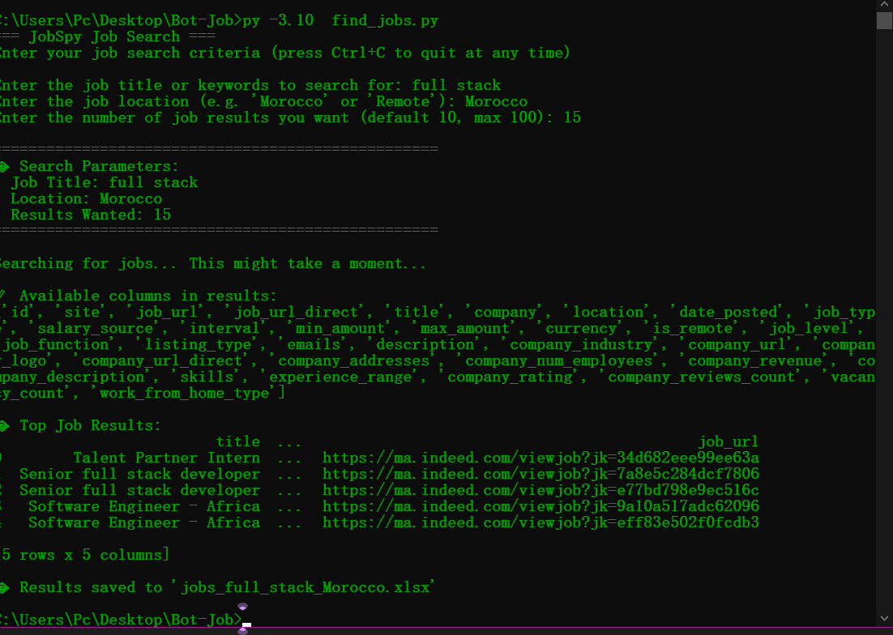

# JobSpy Job Search CLI

A simple Python command-line tool to search for jobs using the `python-jobspy` library.

## Features

- Interactive CLI input for job title, location, and number of results.
- Validates country input against supported countries.
- Displays job listings with title, company, location, posting date, and job URL.
- Saves the results to an Excel file.

## Display Discovery

This tool helps users discover job postings interactively, making job search efficient and customizable. It can be enhanced with filtering or AI features in future versions.

## Screenshot



## Requirements

- Python 3.10+
- See `requirements.txt` for required packages.

## Installation

```bash
pip install -r requirements.txt
```
## Run code
```bash
py -3.10  find_jobs.py
